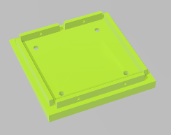

# Cub-Neopixel
Aquest cub de LEDs Neopixels permeten fer un element decoratiu i a la vegada una eina per dissenyar efectes programats realitzant combinacions inimaginables.  

      

Es una adaptació realitzada per [Jordi Mayné](https://github.com/maynej) des de Mechatronic Study jordi.mayne@mechatronicstudy.com 
del disseny  https://github.com/hpsaturn/cube_led_8x8x6_ws2812 

La documentació està disponible en [PDF] (https://github.com/maynej/Cub-Neopixel/tree/main/DOC). També en castellà.

# Arxius per imprimir 
  
Descripció         | Imatge          | Arxiu STL    
------------- | ------------- | ------------- 
Estructura | | [Estructura](STL/cube_body.stl)
Tapa | | [Tapa](STL/Cube_Cap2.stl)
Base | | [Base](STL/Cube_Base2.stl)
Tapa Base | | [Tapa Base](STL/cube_base_lid.stl)

Creative Commons Attribution-NoComercial-ShareAlike 4.0 International (CC BY-NC-SA 4.0)  

## QR
 
